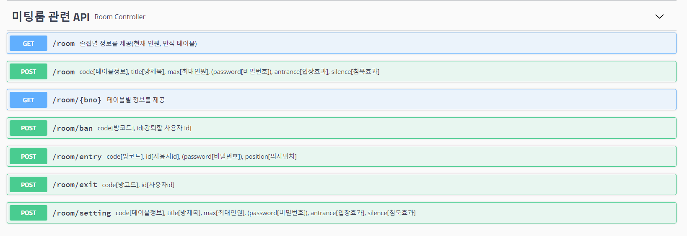
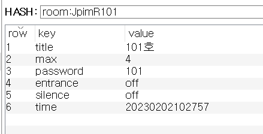
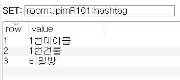
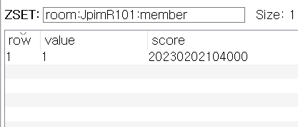
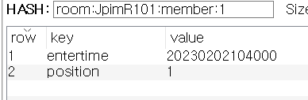
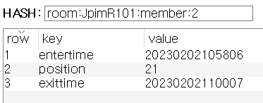
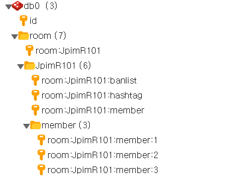
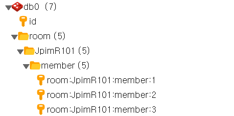

# Room API :beers:



---
### :loudspeaker: [POST] /room

:paperclip: createRoom()

일단 건물이 6개니까 1~6으로 번호 부여

건물별 테이블 번호도 1부터 부여

코드를 보내면 5자리의 랜덤코드생성 후 접미사로 붙임

예) 1번 건물에 1번 테이블   → 101

      4번 건물에 10번 테이블 → 410

:outbox_tray: body

```json
{
  "code": "string",     // 건물, 테이블 번호
  "entrance": 0,        // 입장 시 효과(on(1)/off(0))
  "hashtag": [          // 해시태그
    "string"
  ],
  "max": 0,             // 최대 인원
  "password": "string", // 비밀번호
  "silence": 0,         // 침묵 시 효과(on(1)/off(0))
  "title": "string"     // 방제목
}
```

처음 방정보는 HASH로 저장

room:[방코드]



해시태그는 따로 SET으로 저장

room:[방코드]:hashtag



---

### :loudspeaker: [POST]/room/entry

:paperclip: enterRoom()

| status | response |
| --- | --- |
| 입장 성공했을 때 | success |
| 존재하지 않는 방일 때 | does not exist room |
| 비밀번호가 일치하지 않을 때 | incorrect password |
| 강퇴당한 유저일 때 | banned user |
| 정원을 초과했을 때 | overcapacity |
| 기타 | failed |

:outbox_tray: body

```json
{
  "code": "string",     // 방 코드
  "id": 0,              // 입장하는 유저 아이디
  "password": "string", // 방 비밀번호
  "position": "string"  // 유저가 앉은 의자 번호
}
```

현재 방에 들어와있는 사람들은 ZSET으로 저장

room:[방코드]:memeber

📎value = uid

 📎score = entertime




이력들은 HASH로 저장

room:[방코드]:member:[유저아이디]

✍🏼 key : 들어간 시간, 앉은 위치, 나간 시간



---

### :loudspeaker: [POST] /room/setting

:paperclip: changeRoomSet()


:outbox_tray: body - create와 동일

```json
{
  "code": "string",
  "entrance": 0,
  "hashtag": [
    "string"
  ],
  "max": 0,
  "password": "string",
  "silence": 0,
  "title": "string"
}
```

---

### :loudspeaker: [POST] /room/exit

:paperclip: exitRoom()


:outbox_tray: body

```json
{
  "code": "string",
  "id": 0
}
```

나가면 이력리스트에 exittime 추가됨



방을 나갔을 때 남아있는 사람이 아무도 없으면 자동 방삭제

(이력은 혹시 몰라서 남겨둠)



방 삭제 전



방 삭제 후

 

---

### :loudspeaker: [POST] /room/ban

:paperclip: banUser()


:outbox_tray: body

```json
{
  "code": "string",
  "id": 0
}
```

강퇴리스트는 SET으로 저장

room:[방코드]:banlist

📎value = uid


강퇴되면 자동으로 방에서 나가짐

---

### :loudspeaker: [GET] /room

:paperclip: getBuilding()

술집(6개)마다 2차원 배열로 결과반환

✍🏼 [건물번호][0] = 술집 안에 들어가있는 사람 수

✍🏼 [건물번호][1] = 만석 테이블 수

인원 : 술집 안에 들어가있는 사람수 / 총원

테이블 수 : (총 테이블 수 - 만석 테이블 수) / 총 테이블 수

:inbox_tray: Response body

```json
[
  [
    0,
    0
  ],
  [
    2,
    0
  ],
  [
    0,
    0
  ],
  [
    4,
    1
  ],
  [
    0,
    0
  ],
  [
    0,
    0
  ]
]
```

---

### :loudspeaker: [GET] /room/{건물번호}

:paperclip: getTable()

현재 들어가 있는 사람 수도 같이 제공(current)

:inbox_tray: Response body

```json
[
  {
    "title": "string",
    "max": 4,
    "entrance": "off",
    "silence": "off",
    "time": "20230202124920",
    "code": "XRKeW201",
    "current": 2,
    "hashtag": [
      "string"
    ]
  },
  {
    "title": "string",
    "max": 4,
    "entrance": "off",
    "silence": "off",
    "time": "20230202124928",
    "code": "B6m79202",
    "current": 0,
    "hashtag": [
      "string"
    ]
  }
]
```

